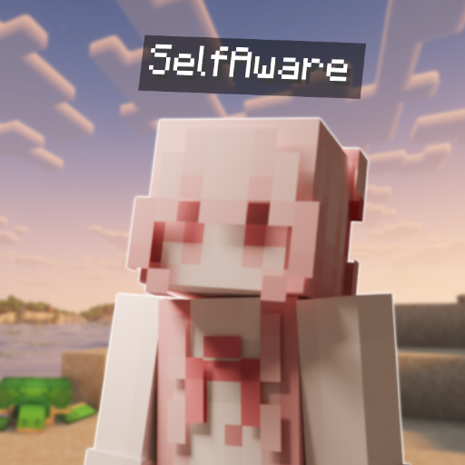

# Selfaware



See your own nametag in third person. That's it for now.

Press F5 to see it from either side. Minecraft still handles the text, team prefix, and name color. The tag hides with F1, in first person, while invisible or spectating, and keeps vanilla's local-player behavior for team visibility.

Install it on your client. Servers and other players don't need it. Fabric and Quilt builds before 26.x require Fabric API and Mod Menu. The 26.x builds only require Mod Menu. Forge and NeoForge do not need either dependency. If Simple Voice Chat is installed too, Selfaware uses its own nameplate renderer so your name gets the same speaker, whisper, disconnected, and disabled icons as other players. That integration is optional and stays off when Simple Voice Chat is missing.

When Simple Voice Chat is connected and idle, no icon is expected. The icon appears when you are talking, whispering, disconnected, or have voice chat disabled, matching Simple Voice Chat's normal player-name behavior.

Open the settings screen with `/selfaware`, from Selfaware in Mod Menu on Fabric or Quilt, or by binding **Open Selfaware menu** in Minecraft's Controls screen. Forge and NeoForge use the built-in command and keybind path. The responsive settings screen and animated player preview are shared across every loader and version. Changes apply immediately and are saved in `config/selfaware.properties`. The SVC and DonutSMP controls stay visible so the layout never changes, but remain unavailable until their integration is active.

Turn on **Server formatting** to use your server-provided tab name and nametag appearance, with your normal team-formatted name as the fallback. On DonutSMP, **DonutSMP rank** controls the rank text separately while **Server formatting** controls the server shadow and background. On 1.19.4 and newer, Selfaware learns that appearance from nearby text-display nametags and remembers it for the server. The separate **Donut money** option works on DonutSMP with 1.21.1, 1.21.11, and 26.2. It reads your balance from the tab footer and adds it as a second row inside the same text display, so both rows use one background. These options default to off. Servers can send different formatting to different viewers, so this is a local approximation, not an exact preview of what everyone else sees.

When a server sends a separate text-display nameplate for your player, Selfaware keeps the duplicate vanilla plate hidden. On supported Donut versions it edits that existing local text display for the rank, money, formatting, and nametag toggles instead of drawing another plate over it.

## Versions

| Loader | Minecraft versions |
| --- | --- |
| Fabric | 1.16.5, 1.18.2, 1.19.2, 1.19.4, 1.20.1, 1.20.2, 1.20.4, 1.20.6, 1.21.1, 1.21.3, 1.21.4, 1.21.5, 1.21.8, 1.21.10, 1.21.11, 26.1, 26.2 |
| Quilt | 1.16.5, 1.18.2, 1.19.2, 1.19.4, 1.20.1, 1.20.2, 1.20.4, 1.20.6, 1.21.1, 1.21.3, 1.21.4, 1.21.5, 1.21.8, 1.21.10, 1.21.11, 26.1, 26.2 |
| Forge | 1.16.5, 1.18.2, 1.19.2, 1.19.4, 1.20.1, 1.20.2, 1.20.4, 1.20.6, 1.21.1, 1.21.3, 1.21.4, 1.21.5, 1.21.8, 1.21.10 |
| NeoForge | 1.20.2, 1.20.4, 1.20.6, 1.21.1, 1.21.3, 1.21.4, 1.21.5, 1.21.8, 1.21.10, 1.21.11, 26.1.2, 26.2 |

## Building

Use JDK 25 to run Gradle. The build compiles each jar for its Minecraft version's Java requirement, and `runClient` selects the matching game runtime. Missing JDKs can be provisioned by Gradle's toolchain resolver. On macOS, the Python build and smoke runners also find Homebrew's `openjdk@25` when `JAVA_HOME` is not set.

```sh
./gradlew build
./gradlew build -Ptarget=1.20.1-forge
./gradlew runClient -Ptarget=1.21.1-fabric
python3 scripts/build.py
python3 scripts/smoke.py
```

The default target is 1.21.1 Fabric. Jars go in `build/<target>/libs/`; use the jar without `-sources` in its name.

[versions.json](versions.json) lists the exact targets. `python3 scripts/build.py --list` prints their ids. The full build runs the same tests and checks jar metadata, mixins, and Java compatibility for every target. CI reads this same list.

`python3 scripts/smoke.py` runs a short runtime set instead of opening every target. It launches one target per renderer adapter and one per loader, stops each client after the timeout, and checks the client log plus exported mixin class. Use `python3 scripts/smoke.py --list` to see the set or pass target ids to run a smaller check.

`python3 scripts/smoke.py --svc-all` runs every declared target with the latest released Simple Voice Chat jar published for that exact Minecraft version and loader. Fabric and Quilt use the published jar directly so its nested API modules stay intact. Forge and NeoForge use the same jar through Loom's remapped Maven runtime. Targets without a released SVC jar are reported as skipped, not treated as working. Results go to `build/smoke/svc-results.json`.

Pass `--loader fabric`, `--loader forge`, `--loader neoforge`, or `--loader quilt` to build one loader's full set.

Every version uses the same feature code. Small renderer adapters cover Minecraft API changes, and the loader entrypoints only register the mod. The version setup follows ideas from [3D Skin Layers](https://github.com/tr7zw/3d-Skin-Layers) and [Simple Voice Chat](https://github.com/henkelmax/simple-voice-chat). [docs/implementation.md](docs/implementation.md) has the details.

Build verification and in-game checks are tracked separately in [docs/verification.md](docs/verification.md). A listed target is not a promise that every modpack works with it.
